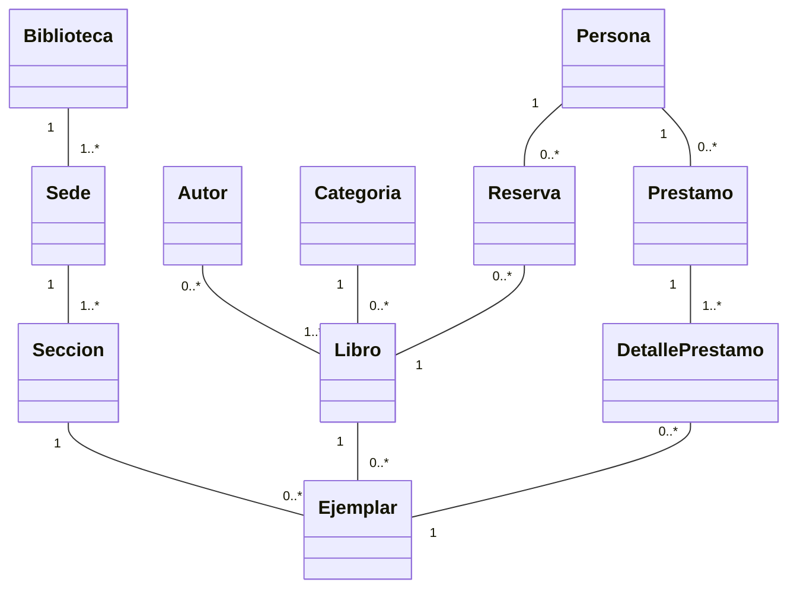

# Jueves: multiplicidad y maestro-detalle

La multiplicidad indica cuantos objetos pueden participar en cada extremo de una relacion.

| Notacion | Lectura |
| --- | --- |
| `1` | exactamente uno |
| `0..1` | cero o uno |
| `*` o `0..*` | cero o muchos |
| `1..*` | uno o muchos |

## Ejemplo maestro-detalle

```text
Orden 1 ---------------- 1..* DetalleOrden
```

`Orden` es el maestro y conserva numero, fecha y cliente. Cada `DetalleOrden` representa una linea con producto, cantidad, precio unitario y subtotal.

Se escoge `1..*` porque la invariante del modelo establece que una orden confirmada debe tener al menos un detalle. Si el sistema permitiera guardar borradores vacios, corresponderia `0..*`. La multiplicidad expresa una regla del dominio, no una preferencia grafica.

## Diagrama completo de dominio



Este modelo contiene once clases. `Prestamo` y `DetallePrestamo` forman el ejemplo maestro-detalle: el maestro identifica a la persona y las fechas generales; cada detalle referencia un ejemplar. La naturaleza exacta de cada relacion y sus criterios de ciclo de vida se estudian en Semana 4.
