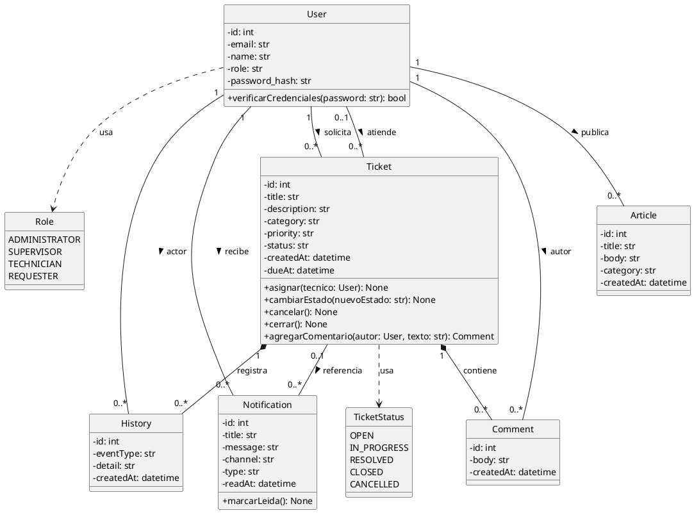
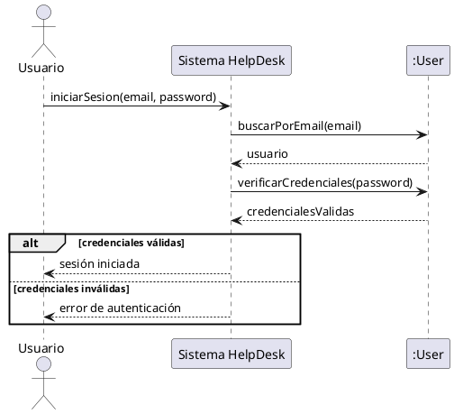
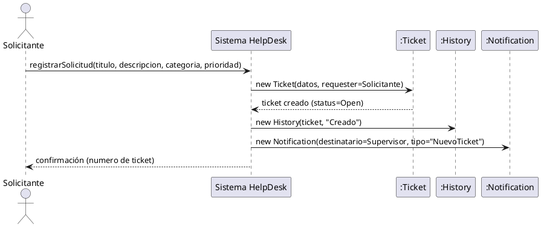
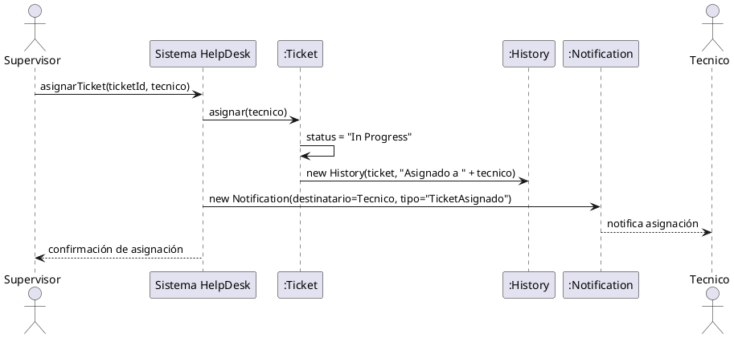
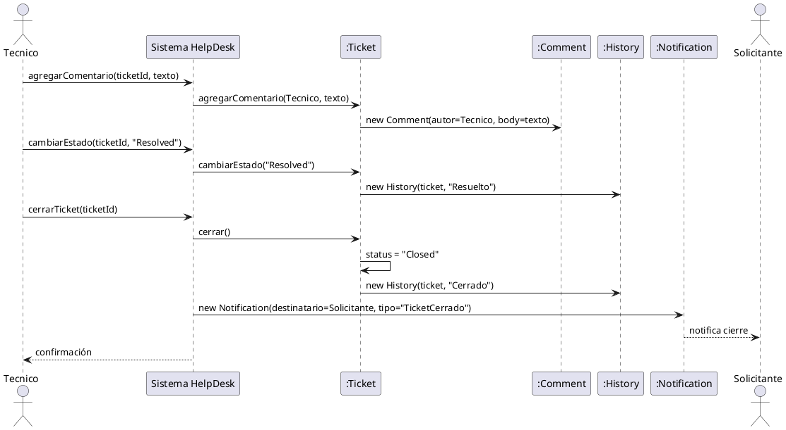
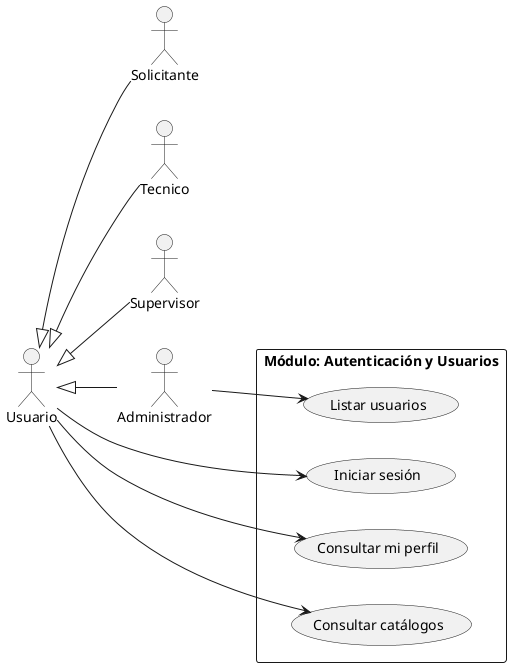
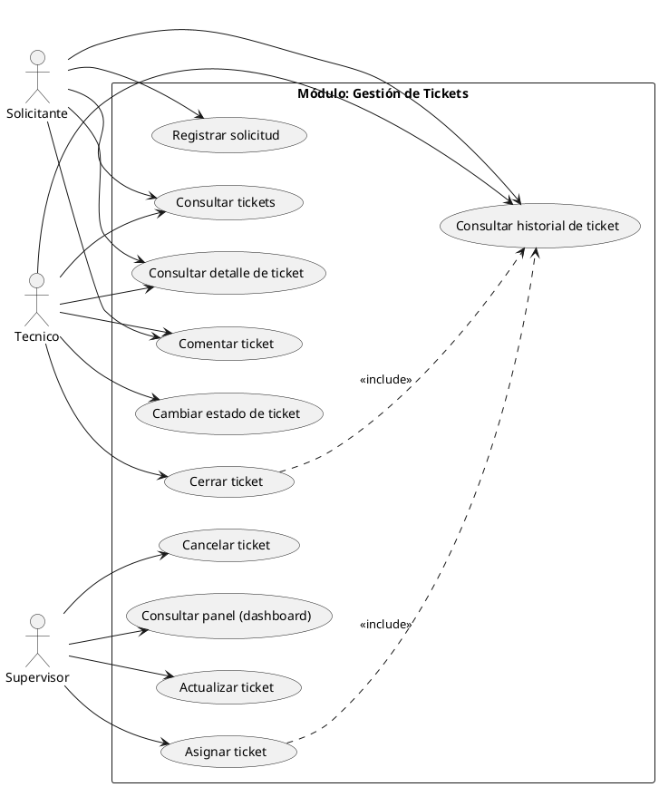
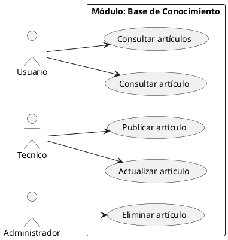
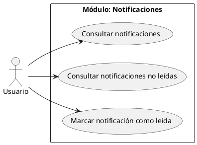

# UML del proyecto final (HelpDesk EDU) — Semana 3 y 4

Código PlantUML listo para copiar en el [editor online de PlantUML](https://www.plantuml.com/plantuml/uml/) o en la extensión de VS Code. Las clases y campos reflejan el modelo real de `help_desk_EDU/app/models/entities.py`, así que sirve como guía progresiva hacia la implementación de semanas posteriores.

## 1. Diagrama de clases completo

Criterio de las relaciones: `Comment` y `History` no tienen sentido sin su `Ticket` (composición, rombo negro en `Ticket`). `Notification` y `Article` referencian a `User` pero conservan identidad propia (asociación). `Ticket.assignee` es opcional (`0..1`) porque un ticket puede estar sin asignar; `Ticket.requester` es obligatorio (`1`).

## 2. Diagramas de secuencia (4)

### 2.1 Iniciar sesión

### 2.2 Registrar solicitud (crear ticket)

### 2.3 Asignar ticket

### 2.4 Resolver y cerrar ticket

## 3. Casos de uso por módulo

Los cuatro actores especializan a `Usuario` (generalización de actor — mismo criterio de herencia conceptual que semana 4).

### 3.1 Autenticación y usuarios

### 3.2 Gestión de tickets

### 3.3 Base de conocimiento

### 3.4 Notificaciones

