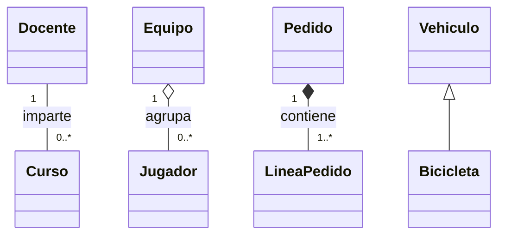

# Semana 4: relaciones entre clases

Esta semana se limita a reconocer y representar relaciones conceptuales en UML:

- asociacion;
- agregacion;
- composicion;
- herencia conceptual.

`super()`, sobrescritura de metodos y polimorfismo quedan fuera del alcance actual. Su implementacion y sus implicaciones se profundizan en Semanas 8 y 9.

## Notacion y criterio

| Relacion | Notacion UML | Criterio de ciclo de vida | Ejemplo |
| --- | --- | --- | --- |
| Asociacion | linea continua | Los objetos colaboran sin pertenencia. | `Docente "1" -- "0..*" Curso` |
| Agregacion | rombo blanco en el todo | La parte puede existir y reutilizarse sin el todo. | `Equipo "1" o-- "0..*" Jugador` |
| Composicion | rombo negro en el todo | La parte pertenece a un solo todo y pierde sentido al desaparecer este. | `Pedido "1" *-- "1..*" LineaPedido` |
| Herencia | linea con triangulo vacio hacia la clase general | Una clase especializada es un tipo de la clase general. | `Vehiculo <|-- Bicicleta` |

Las multiplicidades se escriben en ambos extremos cuando aportan una regla: `1`, `0..1`, `0..*` o `1..*`. El rombo siempre se coloca del lado del todo.

## Ejemplos completos

- Un docente y un curso conservan identidad independiente: asociacion.
- Un jugador puede cambiar de equipo sin dejar de existir: agregacion.
- Una linea pertenece a un pedido especifico y no se comparte: composicion. La invariante exige al menos una linea en un pedido confirmado, por eso se usa `1..*`.
- Una bicicleta es un tipo de vehiculo: herencia conceptual. En esta semana solo se modela la generalizacion, sin implementar comportamiento heredado.

## Precision conceptual

Si un objeto puede existir de forma independiente, la relacion no debe declararse composicion. Por ejemplo, un `GestorRegistros` que consulta objetos `Registro` preexistentes mantiene una asociacion o agregacion segun la propiedad del ciclo de vida, no una composicion automatica.

Los diagramas describen decisiones del dominio. No se incluye una implementacion futura completa: primero debe justificarse la relacion y su multiplicidad.
